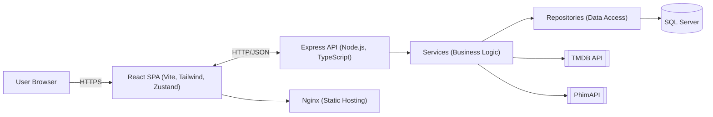
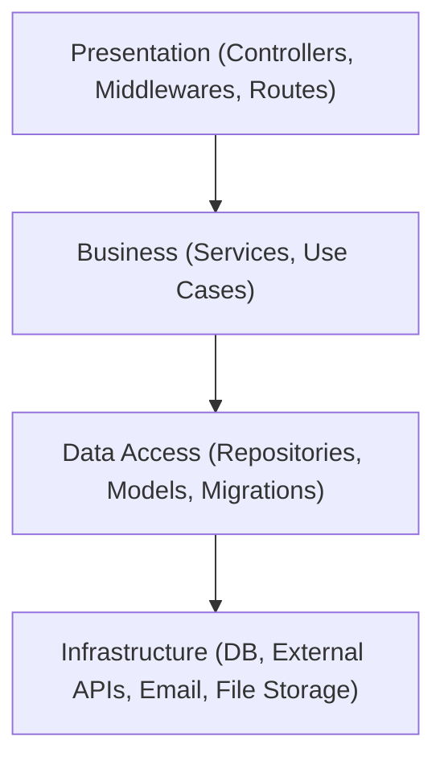

# 🎬 PhimHub — Professional Movie Streaming Platform

<div align="center">

<br />

<a href="https://www.typescriptlang.org/"></a>
<a href="https://react.dev/"></a>
<a href="https://nodejs.org/"></a>
<a href="https://www.microsoft.com/en-us/sql-server"></a>
<a href="https://www.docker.com/"></a>

<p><em>An enterprise-grade, full‑stack movie streaming platform with Clean Architecture and a modern, maintainable codebase.</em></p>

<!-- App Preview using local assets (dark/light) -->
<picture>
  <source media="(prefers-color-scheme: dark)" srcset="frontend/src/assets/branding/phimhub-logo-light.png" />
  
</picture>

</div>

---

## 📌 Highlights

- Clean Architecture (Presentation, Business, Data, Infrastructure)
- React 18 + TypeScript, Zustand, Tailwind CSS, Vite
- Node.js + Express + TypeScript API with JWT auth
- SQL Server with migrations and repository pattern
- HLS streaming, external API integrations (TMDB, PhimAPI)
- Docker-first development and deployment

## 🗂️ Table of Contents

- Architecture Overview
- Clean Architecture (Explained)
- Functional Component (Explained)
- Features
- Technology Stack
- Project Structure
- Quick Start
- Configuration
- API Overview
- Security
- Deployment
- Testing
- Contributing
- License

---

## 🏗️ Architecture Overview

PhimHub is designed for scalability and long-term maintainability. The frontend and backend communicate via REST APIs, with clear boundaries between presentation and business concerns.

### System Diagram (Mermaid)


### Clean Architecture Layers (Mermaid)


---

## 🏛️ Clean Architecture (Explained)

Clean Architecture separates code into concentric layers with one core rule: inner layers must not depend on outer layers. This makes the system easier to test, evolve, and replace parts without ripple effects.

- Presentation Layer: Controllers, middlewares, request/response models
- Business Logic Layer: Services, use cases, domain rules
- Data Access Layer: Repositories, models, migrations
- Infrastructure Layer: DB connections, external services, email, file storage

Dependency rule: Presentation → Business → Data → Infrastructure (only inward dependencies).

```
┌─────────────────────────────────────────────────────────────┐
│                  CLEAN ARCHITECTURE                         │
├─────────────────────────────────────────────────────────────┤
│  🎨 Presentation  →  💼 Business  →  💾 Data  →  🗄️ Infra │
└─────────────────────────────────────────────────────────────┘
```

Why it matters
- Testability: Business rules are framework-agnostic
- Maintainability: Isolated changes with minimal coupling
- Replaceability: Swap frameworks or IO details without touching core logic

---

## ⚛️ Functional Component (Explained)

A Functional Component is a plain JavaScript/TypeScript function that returns UI (JSX). It is stateless by default but can use React Hooks for state, side effects, and lifecycle.

- Simple: A function that returns JSX
- Hooks-based: useState, useEffect, useMemo, etc.
- Encourages composition over inheritance
- Preferred in modern React over class components

Example

```tsx
import { useEffect, useState } from 'react';

type Props = { title: string };

export function ExampleCard({ title }: Props) {
  const [count, setCount] = useState(0);

  useEffect(() => {
    // Side effect example (e.g., analytics or data fetch)
  }, []);

  return (
    <div className="rounded-lg border p-4">
      <h3 className="text-lg font-semibold">{title}</h3>
      <button onClick={() => setCount(c => c + 1)}>Clicked {count} times</button>
    </div>
  );
}
```

---

## 🚀 Features

- Movie & Series Streaming (HLS)
- User Accounts, Profiles, JWT Authentication
- Search & Discover (genres, actors, directors)
- Favorites, Watch History, Custom Lists
- Admin Tools, Analytics (extensible)
- Email notifications and external API importers

---

## 🛠️ Technology Stack

Frontend
- React 18 + TypeScript, Vite, Tailwind CSS
- Zustand (state), React Hook Form, React Router DOM
- HLS.js for streaming

Backend
- Node.js + Express + TypeScript
- JWT auth, bcrypt, Helmet, CORS
- SQL Server, repository pattern, custom migrations
- Multer (file upload), Nodemailer (email), external APIs (TMDB/PhimAPI)

Infrastructure
- Docker & Docker Compose, environment-based config

---

## 📁 Project Structure

Below is the full high‑level layout with comments describing what lives in each directory. Use this as a map when adding features or debugging.

```
phimhub/
├─ docker-compose.yml              # Orchestrates frontend, backend, DB, and seed jobs
├─ README.md                       # Project documentation (you are here)
├─ start-backend.bat               # Windows helper to run backend in dev
├─ start-frontend.bat              # Windows helper to run frontend in dev
├─ TEST_MANUAL_CHECKLIST.md        # Manual QA checklist
├─ db_moi1.bacpac                  # SQL Server database backup used by seeding
│
├─ backend/                        # Node.js + Express API (TypeScript)
│  ├─ Dockerfile                   # Container image for the API server
│  ├─ env.example                  # Example .env with all supported variables
│  ├─ package.json                 # Dependencies and NPM scripts
│  ├─ tsconfig.json                # TypeScript compiler settings
│  ├─ uploads/                     # Local dev uploads (e.g., avatars)
│  │  └─ avatars/
│  └─ src/
│     ├─ index.ts                  # Application entrypoint (Express bootstrap)
│     │                            #  - Creates app, registers middlewares, routes, error handler
│     │                            #  - Starts HTTP server and init DB connection
│     ├─ config/
│     │  └─ database.ts            # SQL Server connection/pool configuration
│     ├─ controllers/              # 🎨 Presentation layer (HTTP handlers only)
│     │  ├─ actor.controller.ts    #  - Validates/parses req, calls service, shapes response
│     │  ├─ auth.controller.ts     #  - Register, login, refresh, logout
│     │  ├─ customList.controller.ts
│     │  ├─ director.controller.ts
│     │  ├─ favorites.controller.ts
│     │  ├─ genre.controller.ts
│     │  ├─ movie.controller.ts
│     │  ├─ tmdb.controller.ts     #  - Endpoints proxying external TMDB/PhimAPI services
│     │  └─ watchHistory.controller.ts
│     ├─ middlewares/              # Cross‑cutting concerns
│     │  ├─ auth.middleware.ts     #  - JWT verification, attach req.user
│     │  ├─ error.middleware.ts    #  - Centralized error -> uniform JSON response
│     │  └─ upload.middleware.ts   #  - Multer config, file type/size validation
│     ├─ services/                 # 💼 Business logic (framework‑agnostic)
│     │  ├─ actor.service.ts       #  - Orchestrates domain rules, calls repositories
│     │  ├─ CustomListService.ts
│     │  ├─ director.service.ts
│     │  ├─ email.service.ts       #  - Nodemailer wrapper, email templates
│     │  ├─ external-api.service.ts#  - TMDB/PhimAPI integrations
│     │  ├─ FavoritesService.ts
│     │  ├─ movie-import.service.ts#  - Import jobs, data mappers
│     │  ├─ tmdb.service.ts
│     │  └─ user.service.ts
│     ├─ models/                   # 💾 Data access layer (repositories)
│     │  ├─ BaseRepository.ts      #  - Shared DB helpers (queries, pagination)
│     │  ├─ ActorRepository.ts     #  - Entity‑specific CRUD/query methods
│     │  └─ ...                    #  - Other repositories (Genres, Movies, Users, etc.)
│     ├─ db/
│     │  └─ migrator.ts            # Migration runner (applies SQL files in order)
│     ├─ migrations/               # SQL migration files (versioned schema)
│     │  ├─ 001_create_database_schema.sql
│     │  ├─ 002_add_slug_to_movies.sql
│     │  └─ ...                    #  - Keep new schema changes in new numbered files
│     ├─ routes/                   # Express Router composition (group routes/modules)
│     ├─ scripts/                  # Utility scripts (e.g., admin tasks, data fixes)
│     ├─ types/                    # Global TS types, DTOs, request/response contracts
│     └─ utils/                    # Small helpers (slugify, pagination, error factories)
│
├─ frontend/                       # React 18 + TS (Vite) SPA
│  ├─ Dockerfile                   # Multi‑stage build -> Nginx static server
│  ├─ nginx.conf                   # SPA routing (history fallback) & headers
│  ├─ index.html                   # SPA root HTML
│  ├─ package.json                 # Dependencies and scripts
│  ├─ vite.config.ts               # Vite config (aliases, env, build)
│  ├─ tailwind.config.js           # Tailwind setup
│  ├─ postcss.config.js            # Tailwind/PostCSS pipeline
│  ├─ public/                      # Static files served at '/'
│  │  └─ assets/                   #  - Put static assets that shouldn't be bundled
│  └─ src/
│     ├─ main.tsx                  # App entry (providers, router, render)
│     ├─ index.css / styles.css    # Global styles
│     ├─ assets/                   # Images/icons imported into bundle (e.g., branding)
│     │  └─ branding/              #  - Project logos; import via `import` in components
│     ├─ app/                      # App shell/layout/providers (if present)
│     ├─ components/               # Reusable, app‑wide UI components
│     ├─ config/                   # Frontend configuration (env, constants)
│     ├─ features/                 # Feature‑oriented folders (route‑scoped UI)
│     │  ├─ account/               #  - Profile, settings, password flows
│     │  ├─ admin/                 #  - Admin dashboard, user/content mgmt
│     │  ├─ catalog/               #  - Browsing, search, filters
│     │  ├─ interactions/          #  - Favorites, watchlists, ratings
│     │  └─ watch/                 #  - Player page, HLS integration
│     ✧  Inside each feature: components/ pages/ hooks/ store/ services/
│     ├─ hooks/                    # Cross‑feature custom hooks
│     ├─ pages/                    # Route‑level components (if not inside features)
│     ├─ services/                 # Axios instance, API clients, interceptors
│     ├─ shared/                   # Shared UI primitives, icons, constants
│     ├─ store/                    # Zustand slices/selectors
│     └─ utils/                    # Utility functions (format, guards, helpers)
│
└─ seed/                           # DB import tooling for local/dev
   ├─ Dockerfile                   # Ubuntu + sqlpackage + import entrypoint
   └─ import.sh                    # Imports .bacpac into SQL Server container
```

### How to add a new API endpoint (backend)
1. Define route in `backend/src/routes` and map to a controller method.
2. Implement handler in `backend/src/controllers/*.controller.ts` (HTTP only).
3. Add business logic in an appropriate `backend/src/services/*.service.ts`.
4. Persist/query via a repository in `backend/src/models/*Repository.ts`.
5. If schema changes are needed, add a new SQL file in `backend/src/migrations` and run the migrator.

### How to add a new UI feature (frontend)
1. Create a folder under `frontend/src/features/<feature-name>`.
2. Add `pages/`, `components/`, `services/` (API calls), and optional `store/` (Zustand slice).
3. Register the route in your router and compose UI from feature components.
4. Reuse `shared/` components and `services/axios` client.

### Environment and configuration
- Backend environment: see `backend/env.example` and your `.env` file.
- Frontend environment: use Vite `import.meta.env.*` (e.g., `VITE_API_URL`).
- Docker: `docker-compose.yml` wires services (frontend, backend, database, seed).

---

## ⚡ Quick Start

Prerequisites
- Node.js ≥ 18
- Docker & Docker Compose
- SQL Server (local or Docker)

Method 1 — Docker (recommended)

```bash
# From repo root
docker compose up -d
# Frontend: http://localhost:8080
# Backend:  http://localhost:3001
```

Method 2 — Manual

```bash
# Backend
cd backend && npm install
cp env.example .env
npm run migrate
npm run dev

# Frontend (new terminal)
cd frontend && npm install
npm run dev
```

---

## 🔧 Configuration

Backend .env

```env
DB_HOST=localhost
DB_NAME=PhimHub
DB_USER=sa
DB_PASS=YourStrong!Passw0rd
DB_PORT=1433
DB_ENCRYPT=true
DB_TRUST_SERVER_CERT=true

JWT_SECRET=your-super-secret-jwt-key-here
JWT_EXPIRES_IN=7d

EMAIL_HOST=smtp.gmail.com
EMAIL_PORT=587
EMAIL_USER=your-email@gmail.com
EMAIL_PASS=your-app-password

TMDB_API_KEY=your-tmdb-api-key
PHIMAPI_BASE_URL=https://phimapi.com

UPLOAD_PATH=./uploads
MAX_FILE_SIZE=100MB
```

Access Points
- Frontend: http://localhost:8080
- Backend: http://localhost:3001
- Database: localhost:1433 (SQL Server)

---

## 📱 API Overview

Auth
- POST /api/auth/register — Register
- POST /api/auth/login — Login
- POST /api/auth/refresh — Refresh token
- POST /api/auth/logout — Logout

Movies & People
- GET /api/movies — List (pagination, filters)
- GET /api/movies/:slug — Details
- GET /api/movies/search — Search
- GET /api/genres | /api/actors | /api/directors

User Interactions
- GET/POST/DELETE /api/favorites
- GET/POST/PUT /api/watch-history
- GET/POST/PUT/DELETE /api/custom-lists

Admin
- GET /api/admin/users
- GET /api/admin/analytics
- POST /api/admin/import
- GET /api/admin/logs

Standard Response

```json
{
  "success": true,
  "message": "Operation successful",
  "data": {
    "items": [],
    "pagination": { "page": 1, "limit": 20, "total": 0, "totalPages": 0 }
  }
}
```

---

## 🔐 Security

- JWT tokens, role-based access (User/Admin)
- Password hashing (bcrypt), token expiry & refresh
- Input validation, parameterized queries
- CORS, Helmet, basic rate limiting

---

## 🚢 Deployment

Docker (production)

```bash
docker compose -f docker-compose.prod.yml up -d
```

Cloud (suggested)
- AWS: S3 + CloudFront (frontend), ECS/Beanstalk (API), RDS (SQL Server)
- Azure: Static Web Apps (frontend), App Service (API), Azure SQL

Performance
- DB indexing, connection pooling
- Caching (e.g., Redis), compression, horizontal scaling

---

## 🧪 Testing

Backend
- npm run test:unit | test:integration | test:e2e | test:coverage

Frontend
- npm run test | test:e2e | test:visual

Targets
- Unit > 80%, key integration flows covered, E2E main user paths

---

## 🤝 Contributing

- Conventional Commits, ESLint (Airbnb), Prettier, TS strict
- Create feature branch, open PR with screenshots (if UI)

Quick Dev Workflow

```bash
npm run install:all
npm run dev
npm run lint && npm run format && npm run test
```

---

## 📄 License

MIT © 2024 PhimHub

---

## 📞 Support

- Issues & Feature Requests: GitHub Issues
- Discussions: GitHub Discussions
- Email: ntt112004h@gmail.com

<div align="center">

⭐ Star this repo if it helps you.

<a href="http://localhost:8080">Homepage</a> • <a href="./README.md">Documentation</a> • <a href="https://github.com/Thinh11042004/PhimHub/issues">Report Bug</a>

</div>
